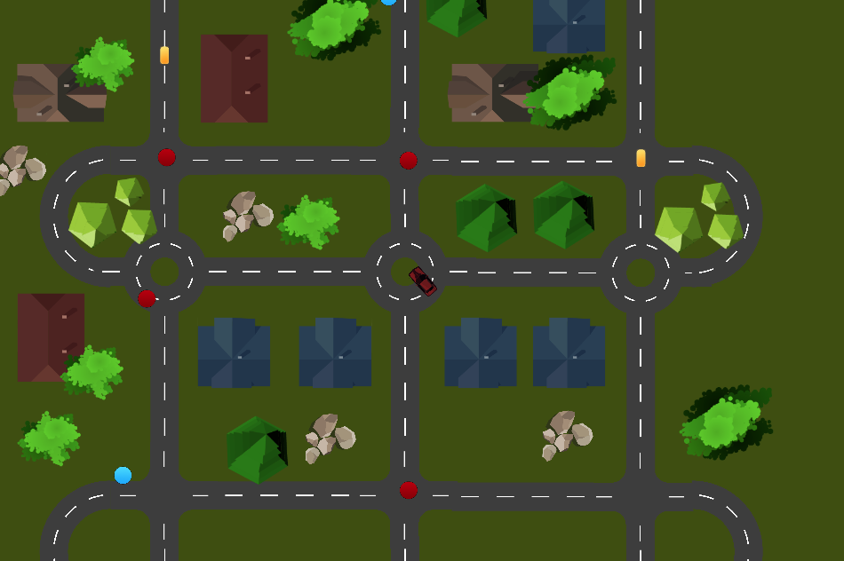

# Delivery Driver 

Clone of [delivery driver](https://www.gamedev.tv/courses/1394720/lectures/33077566) game from [Gamedev.tv](https://www.gamedev.tv) done in cocos creator 3.6

List of subjects

 - Assets
 - Sprites
 - Scripts
 - @Properties (nodes, numbers, colors)
 - LifeCycle (onLoad, start, update, lateUpdate)
 - Inputs (Keyboard)
 - RigidBody (onBeginContact, onPreSolve)
 - BoxCollider
 - Sensor (Trigger)
 - Camera that follows the player

